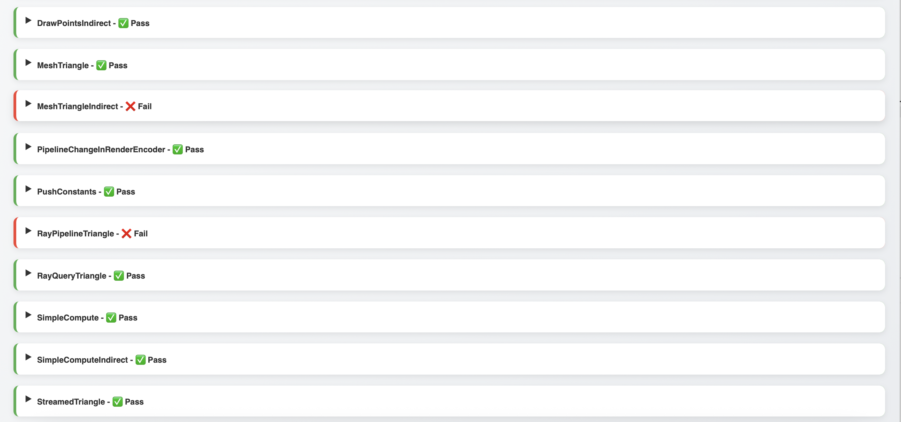

# Kaleidoscope

Kaleidoscope is the internal game engine used to make my own games. Built from the ground up by @AmelieHeinrich.

## Building and running

xmake is required.\
To build: `xmake`\
To run: `xmake run {target}`, target being the name of your app.

## Notes

This engine is **Windows/macOS only** for now. More platforms may be added in the future however, consoles in priority.

## Features

## Rendering
- RHI with D3D12/Vulkan/Metal support with bindless, raytracing, mesh shaders, indirect commands
- Unified shader system, write once run everywhere
- Tiled light culling
- Compute downsample/upsample bloom
- HDR rendering tonemapped with AgX
- Microfacet BRDF - Metallic workflow
- Image based lighting
- Shadow techniques: CSM, raytraced hard/soft shadows
- Custom ImGui/Im3D renderer

## Other
- Input system
- Access to the system sound buffer
- Test suite for various engine modules: 
