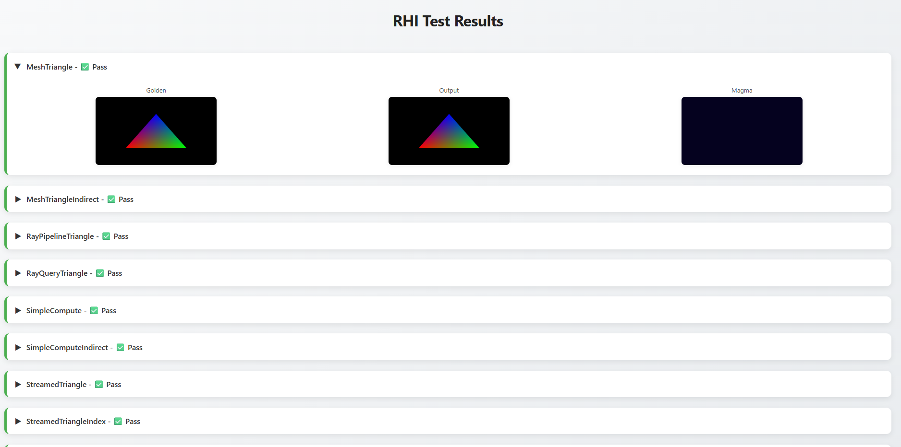
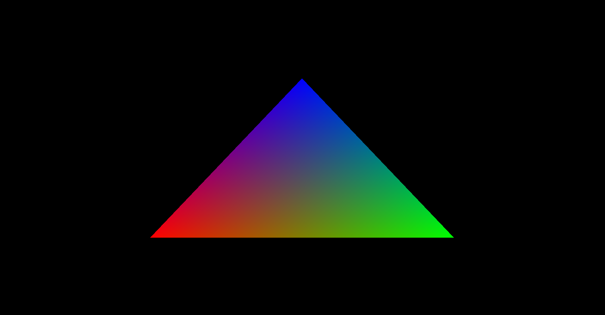
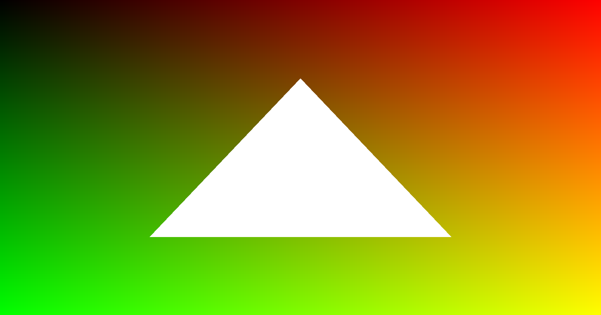
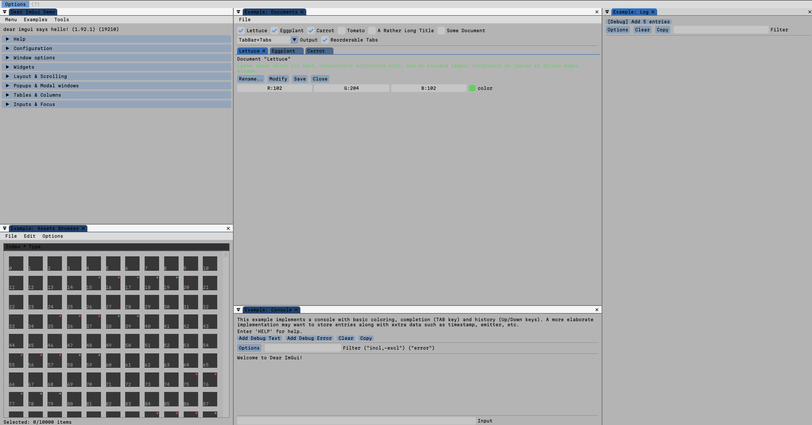
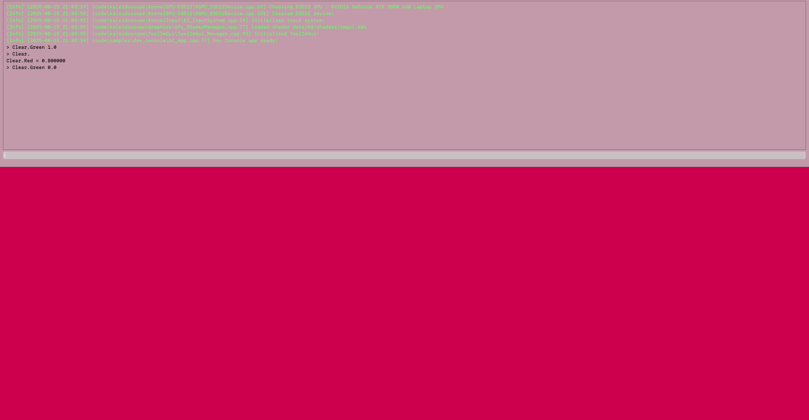

# Kaleidoscope

Kaleidoscope is the internal game engine used to make my own games. Built from the ground up by @AmelieHeinrich.

## Building and running

xmake is required.\
To build: `xmake`\
To run: `xmake run {target}`, target can be your app (for instance, demo_app)

## Notes

This engine is **Windows/MacOS only** for now. More platforms may be added in the future however, consoles in priority.

## Projects using Kaleidoscope

- [Seraph](https://github.com/AmelieHeinrich/Seraph): Showcase renderer for my portfolio
- RF: Indie game I'm making with the engine.

## Features

- RHI with D3D12/Vulkan/Metal support. Has bindless, raytracing, mesh shaders, indirect commands
- Unified shader system, write once run everywhere
- Input system
- Asset management
- Custom ImGui/Im3D renderer
- Access to the system sound buffer
- Test suite for various engine modules, auto test runner written in Haskell: 

## Samples

| Samples | Screenshot |
| -------- | ------- |
| [Hello, Triangle](code/samples/triangle/) |  |
| [Hello, Raytraced Triangle](code/samples/raytracing_simple/) |  |
| [ImGui, Simple](code/samples/imgui_simple/) |  |
| [Im3D Example](code/samples/im3d_simple/) |  |
| [Dev Console](code/samples/dev_console/) |  |
| [Simple mixer](code/samples/mixer/) | (No screenshot) |
